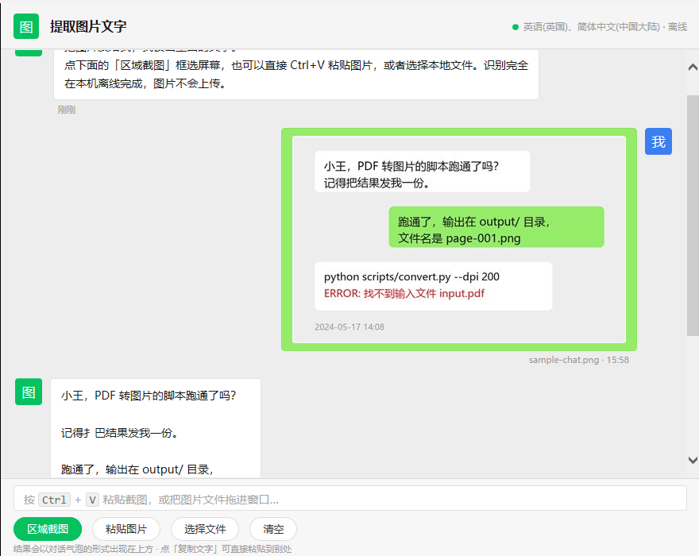

# fetch-picture-word

截图、粘贴或选择一张图片，图片里的文字就会以**微信聊天气泡**的形式出现在对话框里。

```text
你 ──▶ 🖼 图片（右侧绿色气泡）
图 ──▶ 图片里读出来的文字（左侧白色气泡）
```

## 1. 项目解决什么问题

日常最烦的几件事，这个项目一次性解决：

- **图片里的字没法复制**：截图、拍照、别人发来的图片，文字只能手打。这里点一下「区域截图」或按 `Ctrl+V`，文字就变成可以复制的文本。
- **不想把截图传到别人的服务器**：在线 OCR 网站要上传图片、要登录、要配额，敏感内容（合同、工单、聊天记录）根本不敢传。这里全部在本机识别，**离线、无网络请求、无 API key**。
- **装完就能用**：要么是桌面软件（双击图标打开），要么是一个可以被 Agent 自动调用的 Skill，两种形态共用同一套识别逻辑，不需要装 Python 包、不需要装 Tesseract 之类的第三方 OCR。

技术上的关键选择：直接调 **Windows 自带的 OCR 引擎**（`Windows.Media.Ocr`），识别器来自系统已安装的语言包（本机是 `zh-Hans-CN` 与 `en-GB`），因此零依赖、零部署、零网络。

## 2. 主要功能

| 功能 | 说明 |
| --- | --- |
| 区域截图识别 | 拖动鼠标框选屏幕任意区域，松手即识别；按 `Esc` 取消。浮层带暗色遮罩、绿色选框与 `宽 × 高` 实时尺寸标签 |
| 粘贴识别 | `Ctrl+V` 粘贴剪贴板里的图片（截图工具复制后直接用） |
| 文件识别 | 点「选择文件」挑本地图片，或把图片**拖进窗口**；支持 `png / jpg / jpeg / bmp / gif / tif / tiff` |
| 微信风格对话界面 | 自己发的图片是右侧绿色气泡（带缩略图、文件名与时间），识别结果是左侧白色气泡，顶部有头像与引擎状态（可用语言 · 离线） |
| 一键复制 | 结果气泡下方「复制文字」直接把全文写进剪贴板；「查看原始识别结果」对照引擎未整理前的输出 |
| 逐行 / 逐词结构 | 命令行 `-Json` 输出逐行文本和每个词的坐标（`x / y / w / h`），方便自己做版面还原 |
| 多语言 | `-ListLanguages` 列出本机可用的识别语言，`-Lang` / `-Language` 指定本次识别语言 |
| 自动放大预处理 | 识别前按规则放大图片（默认至少 3 倍且不窄于 700 px，上限 2600 px），这一步直接决定了中文小字能不能读对 |
| 文本整理 | 自动修掉引擎在汉字之间插入的空格、中英文之间的空格、被读成汉字「一」的日期连字符（`2024 一 05 一 17` → `2024-05-17`），并按千分位/小数点规则重建数字分隔符（`1 ， 204 ， 338 · 00` → `1,204,338.00`）；`-NoCleanup` / `-Raw` 可关闭 |
| 两种形态 | `desktop/` 装成软件双击即用；`skill/fetch-picture-word/` 是可被 Agent 调用的 Skill（本地服务 + 浏览器页面） |



## 3. 安装方法

### 3.1 桌面版（推荐，装成软件双击就用）

只要 Windows 10/11（自带 .NET Framework 与 PowerShell 5.1），不需要管理员、不需要联网。

```powershell
# 1) 编译启动器 exe（约 1 秒，调用系统自带的 csc.exe）
powershell -ExecutionPolicy Bypass -File desktop\build.ps1

# 2) 安装到当前用户
powershell -ExecutionPolicy Bypass -File desktop\install.ps1
```

安装脚本会做四件事：

- 把 `FetchPictureWord.exe`、`app.ps1`、`ocr.ps1`、`README.txt`、`LICENSE.txt` 复制到 `%LocalAppData%\Programs\FetchPictureWord\`（不需要管理员权限）；
- 在**桌面**和**开始菜单**创建「提取图片文字」快捷方式；
- 在「设置 → 应用 → 已安装的应用」里登记一项「提取图片文字」（版本 0.1.0），可以像普通软件一样卸载；
- 想换目录可以加 `-InstallDir "D:\Apps\FetchPictureWord"`。

卸载：

```powershell
# 命令行卸载（安装目录里的副本自带 -Uninstall）
powershell -ExecutionPolicy Bypass -File "$env:LOCALAPPDATA\Programs\FetchPictureWord\install.ps1" -Uninstall
```

卸载会删掉程序目录、两个快捷方式和注册表项，不留残留。

改界面时可以用桌面版内置的自检模式做无人工回归：它会自动识别一张图、截图、把气泡文字写进日志，然后自己关掉窗口。

```powershell
powershell -STA -File desktop\src\app.ps1 -SelfTest skill\fetch-picture-word\references\sample-receipt.png -SelfTestOut .shot
# 产出：.shot\stage.log（每步日志）、.shot\result.json、.shot\window.png（界面截图）
```

### 3.2 网页版 Skill（给 Agent 用，或临时跑一下）

需要 Windows 10/11 + Python 3（只用标准库，无需 `pip install`）。

```powershell
python skill\fetch-picture-word\scripts\preview.py          # 浏览器自动打开 http://127.0.0.1:8765/
python skill\fetch-picture-word\scripts\preview.py --sample all   # 顺手把 4 张示例图跑一遍看效果
```

常用参数：`--port 8800` 换端口、`--no-browser` 不自动开浏览器、`--verbose` 打印每个请求。

### 3.3 安装到 Agent（让 Agent 自动调用）

DSH 只扫描固定的 Skill 目录，`skill/` 本身不是扫描根。要用起来需要复制过去：

```powershell
# 项目级（只在当前项目生效）
New-Item -ItemType Directory -Force .agents\skills | Out-Null
Copy-Item -Recurse skill\fetch-picture-word .agents\skills\

# 用户级（所有项目可用）
Copy-Item -Recurse skill\fetch-picture-word "$env:USERPROFILE\.dsh\skills\"
```

之后在会话里用 `/fetch-picture-word` 调用，或直接说「把这张图里的文字读出来」。

| | 桌面版 | 网页版 Skill |
| --- | --- | --- |
| 入口 | 桌面 / 开始菜单快捷方式 | `python scripts\preview.py` 后浏览器打开 |
| 依赖 | 无额外依赖（.NET Framework + PowerShell 5.1 + 系统 OCR） | Python 3 标准库 + 浏览器 |
| 适合 | 自己日常用 | 被 Agent 调用、批处理 |
| 卸载 | 设置 → 应用，或 `install.ps1 -Uninstall` | 删掉目录即可 |

## 4. 使用方法

### 4.1 桌面版

双击桌面「提取图片文字」后，界面底部是三个按钮，任选一种方式给图：

| 方式 | 操作 |
| --- | --- |
| 区域截图 | 点「区域截图」→ 屏幕变暗 → 按住左键拖出矩形 → 松手立即识别（`Esc` 取消） |
| 粘贴图片 | 先在任意地方复制图片（截图工具的「复制」、`Ctrl+C`、右键复制图片），回到窗口按 `Ctrl+V` |
| 选择文件 | 点「选择文件」挑图，或直接把图片文件拖进窗口 |

识别完成后：

- 右侧绿色气泡是你的图片（带缩略图和文件名）；
- 左侧白色气泡是识别出的文字，气泡下方显示「共 N 词 · M 行 · xxx ms」；
- 点「复制文字」把全文复制走，点「查看原始识别结果」看引擎未整理的原文；
- 点「清空」清掉当前对话（临时图片存放目录会在退出时自动删除）。

读不出来时不会卡住：左侧气泡会显示「识别失败：<原因>」，例如这张电脑没装对应语言的 OCR 语言包。

### 4.2 网页版

页面和桌面版是同一套界面与操作，只是区域截图走浏览器自己的屏幕共享选择器：点「区域截图」后在系统弹出的共享选择器里选屏幕或窗口，再拖动框选。

### 4.3 命令行（不开界面也能识别）

`skill/fetch-picture-word/scripts/ocr.ps1`：

```powershell
# 纯文本
powershell -NoProfile -ExecutionPolicy Bypass -File skill\fetch-picture-word\scripts\ocr.ps1 -InputPath shot.png

# 结构化 JSON（含逐行文本、原始文本、逐词坐标）
powershell -NoProfile -ExecutionPolicy Bypass -File skill\fetch-picture-word\scripts\ocr.ps1 -InputPath shot.png -Json

# 引擎原始结果（不做空格/标点整理）
powershell -NoProfile -ExecutionPolicy Bypass -File skill\fetch-picture-word\scripts\ocr.ps1 -InputPath shot.png -NoCleanup

# 指定语言 / 改变放大倍数 / 查看本机可用语言
powershell -NoProfile -ExecutionPolicy Bypass -File skill\fetch-picture-word\scripts\ocr.ps1 -InputPath shot.png -Lang en-GB
powershell -NoProfile -ExecutionPolicy Bypass -File skill\fetch-picture-word\scripts\ocr.ps1 -InputPath shot.png -ScaleOverall 4
powershell -NoProfile -ExecutionPolicy Bypass -File skill\fetch-picture-word\scripts\ocr.ps1 -ListLanguages
```

| 参数 | 默认值 | 作用 |
| --- | --- | --- |
| `-InputPath` | 位置参数 | 图片路径；只有 `-ListLanguages` 时可以省略 |
| `-Lang` | 系统语言 | 识别语言标签，如 `zh-Hans-CN`、`en-GB` |
| `-ScaleOverall` | `3` | 至少放大这么多倍（小图低于 `-MinWidth` 时会放得更大） |
| `-MinWidth` | `700` | 放大后至少这么宽（决定中文小字能不能读对） |
| `-MaxWidth` | `2600` | 放大后不超过这么宽 |
| `-ListLanguages` | — | 列出本机可用语言后退出 |
| `-Json` | — | 输出一行 JSON 而不是纯文本 |
| `-NoCleanup` | — | 关闭全部后处理，输出引擎原文 |

退出码：`0` 成功、`2` 输入路径缺失或不可读、`3` OCR 引擎不可用、`4` 识别失败。

桌面版另有一份带帮助信息的副本 `desktop\src\ocr.ps1`（不传参数或传 `-Help` 会打印用法）：

```powershell
powershell -NoProfile -ExecutionPolicy Bypass -File desktop\src\ocr.ps1 -InputPath shot.png -Json
powershell -NoProfile -ExecutionPolicy Bypass -File desktop\src\ocr.ps1 -ListLanguages
```

它多一个 `-Raw`（等于网页版的 `-NoCleanup`），输出的是**扁平小写键**的 JSON（`ok / text / raw / lines / rawLines / engine / language / width / height / scale / elapsedMs`），注意取属性时用 `Text`、`Lines`、`Language` 这种首字母大写的形式。

## 5. 输入输出示例

以下都是真的跑出来的结果，输入图在 `skill/fetch-picture-word/references/`。

### 5.1 微信聊天截图

输入：`sample-chat.png`（900 × 560）

输出（桌面版结果，它会把气泡里被引擎并成一段的两句话拆开，「把」被读成「扌巴」；命令行版会把前两行并成一行）：

```text
小王，PDF 转图片的脚本跑通了吗？
记得扌巴结果发我一份。
跑通了，输出在 output/ 目录，
文件名是 page-001 .png
python scripts/convert.py --dpi 200
ERROR: 找不到输入文件 input.pdf
2024-05-17 14:08
```

### 5.2 带噪点与渐变底的快递单

输入：`sample-receipt.png`（1000 × 500）

输出：

```text
快递单号 SFI 234567890123
收件人张三 13800138000
地址北京市海淀区中关村大街 1 号
Weight 2.5 kg COD 99.00
```

### 5.3 英文数字表格

输入：`sample-latin-table.png`（1100 × 420）

输出（表格被按行拉平，要保留列结构请用 `-Json` 里的词坐标；`26.34％`、`+2.1 pt` 这类结果每次会略有不同）：

```text
QuarterIy Report 02.2024
Revenue
Cost
Profit
Margin
1,204,338.00
887,120.55
317,217.45
26.34％
+ 1 2.4％
+ 9.1％
+ 22.7％
+2.1pt
```

### 5.4 13–18 px 小字截图

输入：`sample-tiny-text.png`（520 × 180）

输出：

```text
文件（F）编辑（E）视图 (V)
缩放 100％DPI 96
状态：已保存 /tmp/a.png
Screenshot 2024.05.17 at 14.0832
```

（桌面版同一张图的输出是 `文件（F）编辑（E）视图 (V)` / `缩放 100％ DPI 96` / `状态：已保存 /tmp/a.png` / `Screenshot 2024.05.17 at 14.0832`。）

### 5.5 JSON 输出（`-Json`）

对 `sample-receipt.png`（1000 × 500）跑 `-Json`，真的输出如下（`input` 省略了长路径）：

```json
{
  "ok": true,
  "engine": "Windows.Media.Ocr",
  "language": "zh-Hans-CN",
  "input": "…\\references\\sample-receipt.png",
  "source": { "width": 1000, "height": 500 },
  "ocrImage": { "width": 2600, "height": 1300, "scale": 2.6 },
  "stats": { "lineCount": 4, "wordCount": 36 },
  "text": "快递单号 SFI 234567890123\n收件人张三 13800138000\n地址北京市海淀区中关村大街 1 号\nWeight 2.5 kg COD 99.00",
  "raw": "快递单号 SFI 234567890123\n收件人张三 13800138000\n地址北京市海淀区中关村大街 1 号\nWeight 2 · 5 kg COD 99 · 00",
  "lines": ["快递单号 SFI 234567890123", "收件人张三 13800138000", "地址北京市海淀区中关村大街 1 号", "Weight 2.5 kg COD 99.00"],
  "rawLines": ["快递单号 SFI 234567890123", "收件人张三 13800138000", "地址北京市海淀区中关村大街 1 号", "Weight 2 · 5 kg COD 99 · 00"],
  "words": [{ "text": "快", "x": 183, "y": 236, "w": 116, "h": 116 }]
}
```

字段含义：`source` 是原图尺寸，`ocrImage` 是实际送去识别的放大图与倍数，`text` 是整理后的全文，`raw` 是引擎原文（可以看到 `2 · 5` 这种原始形态），`lines` / `rawLines` 是逐行版本，`words` 是每个词的矩形坐标（上例只列第一个词，共 36 个）。

### 5.6 出错时的输出

```powershell
powershell -NoProfile -ExecutionPolicy Bypass -File skill\fetch-picture-word\scripts\ocr.ps1 -InputPath D:\shots\missing.png -Json
```

```json
{"ok":false,"code":2,"stage":"input","error":"image not found: D:\\shots\\missing.png"}
```

不传图片路径（退出码同样是 `2`）：

```text
ocr.ps1: no image given: pass -InputPath <file>
```

`-ListLanguages` 在中文系统上的输出：

```text
en-GB	英语(英国)
zh-Hans-CN	简体中文(中国大陆)
```

## 6. 实测效果

七类图片，单张耗时约 0.5–0.6 s：

| 图片类型 | 效果 | 备注 |
| --- | --- | --- |
| 中英混排票据 | ✅ | `Invoice` 可能读成 `lnvoice` |
| 微信聊天截图 | ✅ | 气泡文字、命令行、时间戳都能读；桌面版行切分更细，偶有错字（`把` → `扌巴`） |
| 倾斜 + 低对比度 | ✅ | 自动放大到 2.5x 后正常 |
| 带噪点/渐变底 | ✅ | 日期里的 `-` 可能读成 `一`（已自动修回） |
| 英文数字表格 | ✅ 数字准确 | `1,204,338.00`、`26.34％`、`2.1pt` 正确；表格会按行拉平，需要保留列结构时用 `-Json` 里的词坐标自行排版 |
| 13–18 px 小字 | ⚠️ 少量错字 | 建议框小一点、或先放大再截 |
| 深色应用界面 | ✅ | 宽拉丁字母偶尔被拆开，如 `H a rn ess` |

## 7. 目录结构

```
desktop/                              # 桌面软件（双击即用）
├── build.ps1                         # 调 csc.exe 编译 launcher，并把脚本复制到 dist\
├── install.ps1                       # 安装 / 卸载（-Uninstall），快捷方式 + 应用列表登记
├── fix-bom.ps1                       # 给 .ps1 补 UTF-8 BOM（PowerShell 5.1 必需）
├── src/
│   ├── launcher.cs                   # 无窗口启动器：找到 app.ps1 并以 STA 隐藏窗口拉起
│   ├── app.ps1                       # WinForms 窗口 + 微信风格页面 + 区域截图浮层
│   └── ocr.ps1                       # OCR 引擎封装（CLI + 函数库）
├── dist/                             # 构建产物（exe + app.ps1 + ocr.ps1 + README.txt + LICENSE.txt）
└── references/screenshot.png         # 界面截图

skill/fetch-picture-word/             # Agent 用的 Skill
├── SKILL.md                          # Skill 定义（frontmatter: name / description）
├── agents/openai.yaml                # Codex 风格展示元数据
├── assets/                           # 聊天式前端（chat.html + chat.js，无构建步骤）
├── scripts/
│   ├── preview.py                    # 本地服务：页面 + /api/ocr
│   └── ocr.ps1                       # Windows OCR 引擎封装（UTF-8 with BOM，勿去掉 BOM）
└── references/                       # 自测用示例图片
```

两份实现共用同一套 OCR 逻辑（`desktop/src/ocr.ps1` 与 `skill/.../scripts/ocr.ps1` 算法一致，桌面版把「词级拼装 + 中英文空格修正 + 数字分隔符重建」放在 C# 里跑）。

桌面版为什么是 PowerShell 宿主、而不是纯 C#：`Windows.Media.Ocr` 是 WinRT 接口，而这台机器上只有 .NET Framework 4.0.30319 的 `csc.exe`，没有 Windows SDK、也没有 `dotnet` SDK，`csc` 无法引用 `.winmd` 投影；PowerShell 5.1 自带 `System.Runtime.WindowsRuntime`，可以直接调 WinRT。所以 exe 只负责无窗口拉起（图标、快捷方式、AppUserModelID），窗口和识别在 PowerShell 里跑——对用户来说仍然是「双击一个软件」。

## 8. 已知限制

- **仅 Windows**：依赖系统自带的 `Windows.Media.Ocr`，且需要装好对应语言的 OCR 语言包（用 `-ListLanguages` 查看）。桌面版还要求 .NET Framework 4.x 与 PowerShell 5.1，Windows 10/11 都自带。
- **网页版必须通过本地服务打开页面**：浏览器的区域截图（`getDisplayMedia`）和剪贴板图片读取只在 http(s) 来源下可用，直接双击 `assets/chat.html` 用不了。桌面版没有这个限制，区域截图由程序自己实现。
- **后处理只做保守修正**：中英文之间的空格、被读成「一」的日期连字符、按千分位/小数点重建的数字分隔符、全角标点。像 `lnvoice`（应为 `Invoice`）、`扌巴`（应为 `把`）这种引擎级错字不自动改，需要人工核对；`-NoCleanup` / `-Raw` 和 JSON 里的 `raw` 可用来对照。`％` 故意保持全角（中文排版本来就这么写），不做半角转换。
- **识别精度取决于字号**：13–18 px 的小字即使放大到 3 倍也可能错一两个字，框选时尽量只框文字区域。
- **高 DPI 屏幕已适配**：`app.ps1` 启动时会调用 `SetProcessDpiAwarenessContext`；不这样做的话，高 DPI 机器上的 IE 内核会把整页按 200% 拉伸，底部输入框和提示行会被挤出窗口（本机 200% 缩放时踩到过）。
- **所有 `.ps1` 必须保持 UTF-8 with BOM**：PowerShell 5.1 读取没有 BOM 的 `.ps1` 会按 GBK 解码，脚本里的中文会变乱码、内嵌页面脚本会整段失效。改完脚本跑一下 `desktop\fix-bom.ps1` 检查。

## 9. 许可

[MIT](LICENSE)（Copyright © 2026 fetch-picture-word contributors）。识别引擎来自 Windows 系统组件，本项目只做调用与结果整理。
