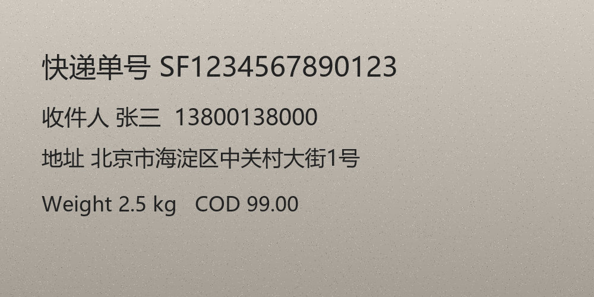

# Fetch Picture Word

把图片里的文字提取出来。页面是一个微信风格的对话框：图片以聊天气泡的形式贴在右边，识别出来的文字以气泡的形式出现在上方，底下是「区域截图 / 粘贴图片 / 选择文件 / 清空」按钮。

识别在**本机离线**完成（Windows 自带的 `Windows.Media.Ocr` 引擎），图片不出这台电脑，不需要联网、不需要 API key、不需要第三方 OCR 依赖。

## When to use

- 用户给了一张图（截图、照片、扫描件、聊天截图）并想知道里面的文字。
- 用户想「截取屏幕上某一块区域」然后读出那块区域的文字。
- 用户粘贴了一张图到会话里，希望得到可直接复制/编辑的文本。

## Quick start

```powershell
# 启动对话框（默认 http://127.0.0.1:8765，会自动打开浏览器）
python scripts\preview.py

# 换端口 / 不自动开浏览器
python scripts\preview.py --port 8800 --no-browser
```

在页面里三种给图方式任选一种：

| 方式 | 操作 |
| --- | --- |
| 区域截图 | 点「区域截图」，浏览器弹出共享选择器，选屏幕/窗口后拖动矩形框选，松手即识别 |
| 粘贴图片 | 先在别处 `Ctrl+C` 复制图片，回到页面按 `Ctrl+V` |
| 选择文件 | 点「选择文件」挑本地图片，或直接把图片拖进页面 |

识别结果直接作为气泡出现在对话框上方；气泡下面有「复制文字」按钮，点一下即可复制全文。

## Command line OCR

不开页面也能用，`scripts/ocr.ps1` 是真正的识别脚本（PowerShell 5.1，调用系统 OCR）：

```powershell
# 纯文本输出（默认，清理过空格/标点）
powershell -NoProfile -ExecutionPolicy Bypass -File scripts\ocr.ps1 -InputPath shot.png

# 结构化 JSON：语言、尺寸、逐行文本、每个词的位置
powershell -NoProfile -ExecutionPolicy Bypass -File scripts\ocr.ps1 -InputPath shot.png -Json

# 保留引擎原始结果（不做空格与标点清理）
powershell -NoProfile -ExecutionPolicy Bypass -File scripts\ocr.ps1 -InputPath shot.png -NoCleanup

# 指定语言 / 放大倍数（小字放大更多）
powershell -NoProfile -ExecutionPolicy Bypass -File scripts\ocr.ps1 -InputPath shot.png -Lang en-GB -ScaleOverall 4

# 列出本机可用的 OCR 语言
powershell -NoProfile -ExecutionPolicy Bypass -File scripts\ocr.ps1 -ListLanguages
```

参数：

| 参数 | 默认 | 说明 |
| --- | --- | --- |
| `-InputPath` | 无 | 要识别的图片；只有 `-ListLanguages` 时可以省略，其余情况给了空值会报 `no image given`（退出码 2） |
| `-Lang` | 系统语言 | BCP-47 标签，如 `zh-Hans-CN`、`en-GB` |
| `-ScaleOverall` | `3` | 整体放大倍数，字太小可调到 4–5 |
| `-MinWidth` | `700` | 宽度不足时自动放大到这个值 |
| `-MaxWidth` | `2600` | 放大上限，避免超大图拖慢识别 |
| `-Json` | 关 | 输出 JSON（见下） |
| `-NoCleanup` | 关 | 保留引擎原始文本，不做后处理 |
| `-ListLanguages` | 关 | 只列出本机可用语言 |

退出码：`0` 成功、`2` 输入路径不可读、`3` OCR 引擎不可用、`4` 识别失败。

## Input / Output

输入：任意包含文字的位图，例如



输出（`-Json`，下面是 `references/sample-receipt.png` 的实测结果，`words` 只摘了开头几个）：

```json
{
  "ok": true,
  "engine": "Windows.Media.Ocr",
  "language": "zh-Hans-CN",
  "input": "…\\references\\sample-receipt.png",
  "source": { "width": 1000, "height": 500 },
  "ocrImage": { "width": 2600, "height": 1300, "scale": 2.6 },
  "stats": { "lineCount": 4, "wordCount": 36 },
  "text": "快递单号 SFI 234567890123\n收件人张三 13800138000\n地址北京市海淀区中关村大街 1 号\nWeight 2.5 kg COD 99.00",
  "raw": "快递单号 SFI 234567890123\n收件人张三 13800138000\n地址北京市海淀区中关村大街 1 号\nWeight 2 · 5 kg COD 99 · 00",
  "lines": ["快递单号 SFI 234567890123", "收件人张三 13800138000", "地址北京市海淀区中关村大街 1 号", "Weight 2.5 kg COD 99.00"],
  "rawLines": ["快递单号 SFI 234567890123", "收件人张三 13800138000", "地址北京市海淀区中关村大街 1 号", "Weight 2 · 5 kg COD 99 · 00"],
  "words": [
    { "text": "快", "x": 183, "y": 236, "w": 116, "h": 116 },
    { "text": "SFI", "x": 703, "y": 243, "w": 172, "h": 93 }
  ]
}
```

`source` 是原图尺寸，`ocrImage` 是实际送去识别的放大图（这里按 `-MinWidth`/`-ScaleOverall` 放大到 2.6 倍），`words` 的坐标基于 `ocrImage`。

失败时（退出码非 0）：

```json
{ "ok": false, "code": 2, "stage": "input", "error": "image not found: D:\\shots\\missing.png" }
```

## Test results

七类图片的实测结果（`scripts\ocr.ps1`，耗时约 0.5 s/张）：

| 图片类型 | 结果 | 备注 |
| --- | --- | --- |
| 中英混排票据 | ✅ 全部读出 | `Invoice` 可能被读成 `lnvoice` |
| 微信聊天截图 | ✅ 全部读出 | 气泡文字、命令行、时间戳都能读 |
| 倾斜 + 低对比度 | ✅ 全部读出 | 放大到 2.5x 后正常 |
| 带噪点/渐变底 | ✅ 全部读出 | 日期里的 `-` 可能读成 `一`（已自动修回） |
| 英文数字表格 | ✅ 数字准确 | `1,204,338.00`、`26.34％`、`2.1pt` 正确；表格会按行拉平，要保留列结构可用 `-Json` 里的词坐标自行排版 |
| 13–18 px 小字 | ⚠️ 少量错字 | CJK 偏旁可能出错，建议框小一点、或先放大再截 |
| 深色应用界面 | ✅ 大体正确 | 宽拉丁字母偶尔被拆开，如 `H a rn ess` |

## Notes

- **Windows only**：依赖系统自带的 `Windows.Media.Ocr`。系统里没装对应语言的 OCR 语言包时，用 `-ListLanguages` 确认；Windows 10/11 中文版默认带 `zh-Hans-CN` 与 `en-GB`。
- **`scripts/ocr.ps1` 必须保持 UTF-8 with BOM**：PowerShell 5.1 读取没有 BOM 的 `.ps1` 会按 GBK 解码，脚本里的中文会变成乱码。用编辑器改完请确认 BOM 还在。
- **后处理只做保守修正**：CJK 之间的空格、数字分隔符（按千分位/小数点判别，`1,204,338.00` 不会被写成 `1.204.338.00`）、全角标点、CJK 与 ASCII 之间的空格。中文里的全角 `％` 保持全角不转半角。像 `lnvoice`（应是 `Invoice`）这类引擎级错字不会被自动改，需要人工核对；`-NoCleanup` 或 JSON 里的 `raw` 可以对照。
- **页面必须从本地服务打开**：浏览器的区域截图（`getDisplayMedia`）和剪贴板读取只在 http(s) 来源下可用，直接双击 `assets/chat.html` 用不了。所以先跑 `scripts\preview.py`。
- 依赖：Python 3.8+ 标准库、PowerShell 5.1、Edge/Chrome/Firefox 任一现代浏览器。无需 npm / pip 安装任何包。
